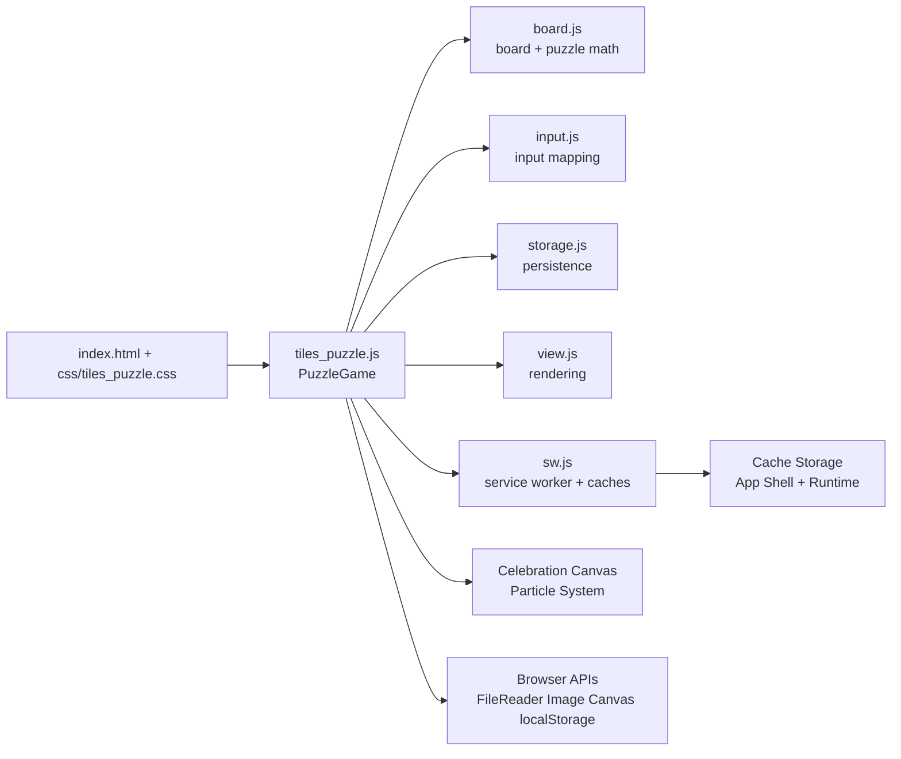
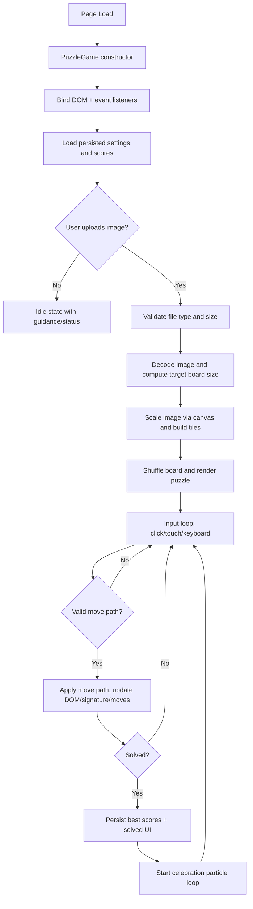
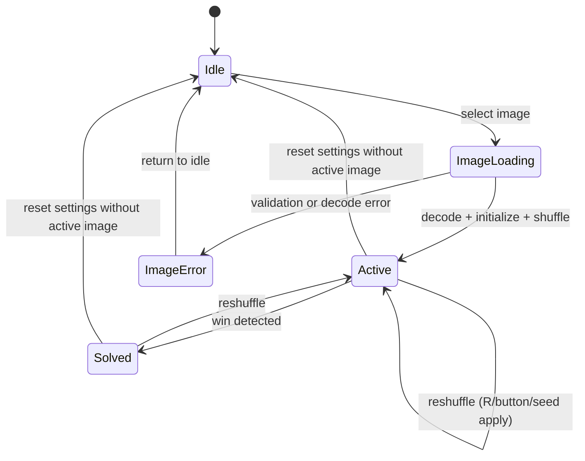
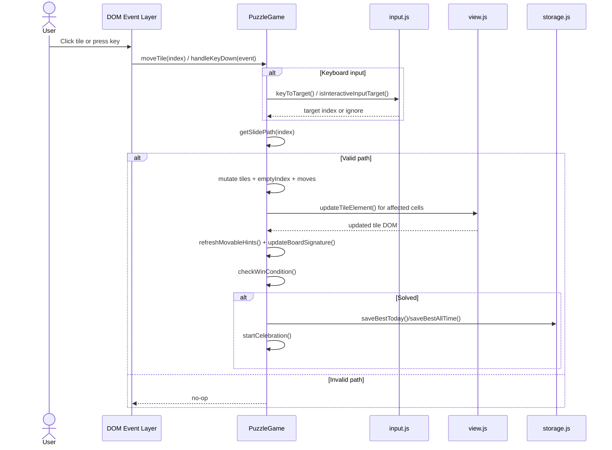
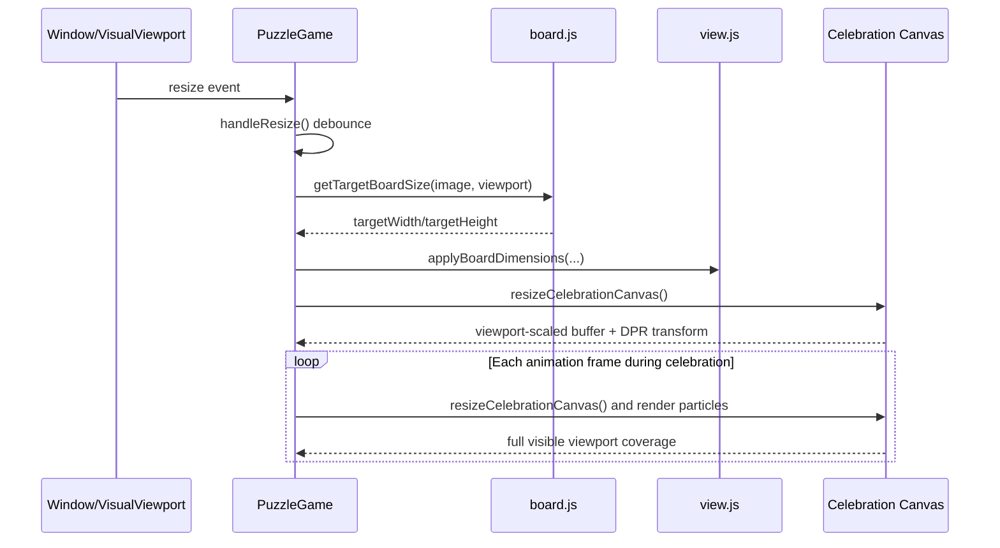

# Software Architecture

## Related Files

- [README.md](../README.md) — Project overview, usage, and testing guide
- [js/tiles_puzzle.js](../js/tiles_puzzle.js) — Main `PuzzleGame`
  controller and UI orchestration
- [js/board.js](../js/board.js) — Board sizing, adjacency, valid-move, and
  puzzle-math helpers
- [js/input.js](../js/input.js) — Keyboard/touch gesture mapping helpers
- [js/storage.js](../js/storage.js) — localStorage keying and persistence
  helpers
- [js/view.js](../js/view.js) — Board and tile rendering helpers
- [sw.js](../sw.js) — Service worker install/activate/fetch handlers
  for PWA caching and offline support

## Project Structure

``` text
tiles_puzzle/
├── index.html                    # Main HTML structure
├── css/
│   └── tiles_puzzle.css          # Styling and responsive layout
├── js/
│   ├── tiles_puzzle.js           # Main game controller and UI orchestration
│   ├── board.js                  # Board sizing, movement, and puzzle math helpers
│   ├── input.js                  # Keyboard/touch input mapping helpers
│   ├── storage.js                # localStorage keying and persistence helpers
│   └── view.js                   # Rendering helpers for board and tiles
├── sw.js                         # Service worker for install + offline caching
├── doc/
│   └── software_architecture.md  # Architecture documentation
├── LICENSE                       # MIT License
└── README.md                     # Project overview and usage
```

## Technical Stack

- **HTML5**: Semantic markup and document structure
- **CSS3**: Modern styling with gradients, flexbox, and responsive design
- **JavaScript (ES6+)**: Class-based OOP with async/await for image processing
  and animations
- **Canvas API**: Dynamic tile extraction, image manipulation, and
  particle-based celebration animation
- **localStorage API**: Persistent puzzle state and score tracking per grid
  size and date
- **Service Worker + Cache Storage API**: Installability, app-shell precache,
  runtime asset caching, and offline navigation fallback

## Core Components

### Module Responsibilities

- **`tiles_puzzle.js` (controller/UI orchestration)**:
  - Owns `PuzzleGame` runtime state and DOM updates
  - Handles image loading/scaling lifecycle and rendering
  - Coordinates movement (single-step and multi-tile line shifts), win checks,
    shuffle flow, and status/move displays
  - Handles viewport-aware celebration canvas resizing via `visualViewport`
    fallback logic
- **`board.js` (board and puzzle math)**:
  - Creates solved tile arrays and puzzle naming
  - Computes target board size and Manhattan distance
  - Provides adjacency/valid-move logic for arbitrary grid sizes (3×3, 4×4,
    5×5)
  - Supplies seeded RNG (`createSeededRandom()` — LCG 32-bit) for
    deterministic shuffle debugging via `?seed=` URL parameter
  - Exports puzzle helper functions: `isAdjacent()`, `getValidMoves()`,
    `getManhattanDistance()`, `getPuzzleName()`, `pickRandomItem()`
- **`input.js` (input interpretation)**:
  - Maps keyboard events to move targets
  - Maps swipe deltas to move targets
  - Detects when key input should be ignored for focused form-like elements
- **`storage.js` (persistence boundaries)**:
  - Encapsulates localStorage keys for difficulty, number overlay, and best
    scores
  - Per-grid-per-date isolation: `puzzle15_best_3x3_2026-03-27` (daily),
    `puzzle15_bestMoves_3x3` (all-time)
  - Loads/saves/resets best scores with automatic legacy key migration on first
    run
  - Prunes obsolete daily score keys and centralizes date-key formatting
  - Exports functions: `getTodayKey()`, `getAllTimeKey()`, `loadBestScores()`,
    `saveBestToday()`, `saveBestAllTime()`, `resetBestScores()`,
    `resetAllSettings()`, `migrateLegacyScoreKeys()`, `pruneOldBestKeys()`
- **`view.js` (rendering boundaries)**:
  - Applies board dimension styles (grid columns) to the puzzle container
  - Creates tile `<div>` elements with proper background-image clipping and
    number overlay
  - Updates tile visual state: empty space marker, background-position for
    image slices, number display
  - Exports functions: `applyBoardDimensions()`, `createTileElement()`,
    `updateTileElement()`
- **`sw.js` (PWA/offline boundaries)**:
  - Pre-caches app shell and static assets on service worker install
  - Removes stale cache versions during activate lifecycle
  - Handles navigation requests with network-first and cache fallback
  - Handles same-origin asset requests with cache-first runtime strategy
  - Supports immediate update takeover via `SKIP_WAITING` message channel
- **PWA bootstrap in `tiles_puzzle.js`**:
  - Registers service worker when secure context is available
  - Captures `beforeinstallprompt` and conditionally exposes the install action
  - Handles `appinstalled` to finalize install UX state
  - Hides install action in standalone display mode

### Component Interaction Diagram



### `PuzzleGame` Responsibilities

- Initializes DOM element references and registers event listeners (tiles,
  canvas, buttons, inputs)
- Maintains active game state (`tiles`, `emptyIndex`, `moves`, dimensions,
  solved/active/seeded flags)
- Delegates board calculations to `board.js`, input mapping to `input.js`,
  persistence to `storage.js`, and rendering details to `view.js`
- Renders the board and applies partial DOM updates for performant tile moves
- Orchestrates celebration animation lifecycle: triggered on win condition,
  cleaned up on shuffle/reset
- Synchronizes accessibility attributes (`aria-pressed` on difficulty/number
  toggles, ARIA live region status)
- Manages seeded shuffle state and URL synchronization via `replaceState`

## Game State Management

The game maintains the following state:

```javascript
{
  // Core puzzle state
  gridSize: Number       // Current grid side length (3, 4, or 5)
  totalTiles: Number     // gridSize * gridSize
  tiles: Array           // Array of tile objects ({ correctIndex })
  emptyIndex: Number     // Current position of the empty space (0–totalTiles-1)
  moves: Number          // Current move count
  
  // Rendering state
  tileWidth: Number      // Width of each tile in pixels (boardWidth / gridSize)
  tileHeight: Number     // Height of each tile in pixels (boardHeight / gridSize)
  boardWidth: Number     // Scaled board width in pixels
  boardHeight: Number    // Scaled board height in pixels
  
  // Image processing state
  originalImageDataUrl: String  // Original file as Data URL (used for resize recalculation)
  scaledImageDataUrl: String    // Screen-fitted scaled image as Data URL
  originalImageEl: Image  // Cached Image object for performance
  
  // Game progress state
  isGameActive: Boolean  // Whether a puzzle is currently loaded
  isSolved: Boolean      // Whether the puzzle has been solved
  seedValue: String|null // Seeded RNG seed if set via URL or input
  
  // Celebration animation state
  celebrationCanvas: HTMLCanvasElement  // Full-screen overlay canvas
  celebrationCtx: CanvasRenderingContext2D  // Canvas 2D context
  celebrationParticles: Array  // Array of particle objects (sparks and confetti)
  celebrationFrameId: Number   // requestAnimationFrame handle
  celebrationEndAt: Number     // Timestamp when celebration ends (5 seconds after win)
  celebrationBurstAt: Number   // Timestamp of next particle burst (~350–550ms intervals)
}
```

## Image Processing Pipeline

1. **Read File**: User selects an image file; `FileReader` converts it to a
   Data URL stored as `originalImageDataUrl`
2. **Create Image**: A new `Image` object loads the Data URL to read its
   natural dimensions
3. **Scale to Screen**: Board dimensions are computed through `board.js`
   helpers from viewport size and image aspect ratio; image is drawn onto a
   `Canvas` at the target size to produce `scaledImageDataUrl`
4. **Tile Object Array**: `totalTiles` lightweight tile objects
   (`correctIndex`) are created — no per-tile canvases
5. **Render**: Each tile `<div>` uses `scaledImageDataUrl` as
   `background-image`, with `background-position` offset calculated from the
   tile's `correctIndex` to show only its slice of the image

## Win Celebration System

When a puzzle is solved, a full-screen particle animation plays for
approximately 5 seconds:

- **Trigger**: `checkWinCondition()` calls `startCelebration()` on match
- **Particle Types**:
  - **Sparks**: ~90 per burst, circles (1.5–11.8 px radius), primary color
    palette, physics-based trajectories (upward velocity 80–360 px/s, gravity
    180–360 px/s²)
  - **Confetti**: ~14+ per spawn, rectangles (3–5 px width/height), falling
    from top with horizontal drift
- **Physics**: Velocity × drag (0.988–0.995 per frame) + gravity per
  timestep, rotation with angular velocity, alpha fade-out over particle
  lifetime (1.6–4.7 seconds)
- **Lifecycle**:
  - Burst spawning every 350–550ms for full 5-second duration (~5 bursts =
    ~450+ total particles)
  - Canvas refresh at 60fps via `requestAnimationFrame`
  - Automatic cleanup on win/shuffle/reset or 5-second expiry
  - Hidden by default, shown (`.active` class) only during celebration
- **Accessibility**: Canvas marked `aria-hidden` (non-interactive overlay,
  particles purely visual)

## Responsive Design

The game adapts to different screen sizes:

- **Desktop**: Side-by-side layout with puzzle grid and info panel; wrapping
  engages when width is constrained
- **Tablet/Mobile**: Stacked layout with fluid control rows (difficulty, seed,
  action buttons) to avoid overflow
- **Narrow mobile**: Extra small-screen breakpoint ensures no clipping/cropping
  in menu/control sections
- **Aspect Ratio**: Board preserves original image aspect ratio (portrait or
  landscape)
- **Dynamic viewport canvas**: Celebration canvas tracks effective visual
  viewport size (`visualViewport` with fallback), including mobile browser UI
  changes
- **High-DPI**: Celebration canvas respects `devicePixelRatio` for crisp
  rendering on high-density displays

## Feature Overview (Current)

- **Line-shift tile movement**:
  - Click/tap any tile aligned with the gap (same row or column) to shift the
    whole segment toward the gap in one move
  - Adjacent clicks still perform single-step moves (with FLIP animation)
  - Keyboard parity: `Shift+Arrow` and `Shift+WASD` trigger whole-line shifts
- **Deterministic shuffling**:
  - `?seed=value` URL param or in-app Seed control drives deterministic board
    generation
- **Responsive UI + board + canvas**:
  - Board scales against available viewport
  - Surrounding interface wraps/reflows at tablet and phone breakpoints
  - Celebration canvas dynamically follows visible viewport to avoid cropping
- **Persistence boundaries**:
  - Difficulty, number overlay, and per-grid best scores are isolated in
    localStorage with migration and pruning logic

## Main Runtime Flow



## PWA Runtime Flow

```mermaid
flowchart TD
    A[Page Load over HTTP(S)] --> B[tiles_puzzle.js registers service worker]
    B --> C[sw.js install event]
    C --> D[Precache app shell and static assets]
    D --> E[sw.js activate event]
    E --> F[Delete stale caches and claim clients]
    F --> G[Normal app runtime]

    G --> H{Request type}
    H -->|Navigation| I[Network-first]
    I -->|Network fail| J[Fallback to cached page/index]

    H -->|Same-origin GET asset| K[Cache-first]
    K -->|Cache miss| L[Fetch and store in runtime cache]

    G --> M{Install prompt available}
    M -->|Yes| N[Show Install App action]
    N --> O[beforeinstallprompt.prompt]
    O --> P[appinstalled event and standalone launch support]
```

## Offline and Install Design Notes

- Service worker registration is intentionally gated by secure context +
  browser support checks.
- App-shell precache covers the full UI scaffold and static dependencies so the
  app can bootstrap offline after first successful visit.
- Runtime cache captures additional same-origin GET resources encountered after
  installation.
- Navigation fallback keeps the SPA-like shell reachable even when network is
  unavailable.
- User-selected local files are not persisted by the service worker; privacy
  behavior remains unchanged.

## Game Lifecycle State Chart



## Object Message Exchange

### Sequence: Move Request (Click or Keyboard)



### Sequence: Responsive Resize and Celebration Canvas Update



## Testing and Verification Mapping

- **Movement correctness**:
  - Adjacent keyboard/click movement
  - Non-adjacent aligned click line-shift behavior
  - `Shift+Arrow` and `Shift+WASD` whole-line keyboard behavior
- **Responsiveness and overflow**:
  - No horizontal overflow checks across portrait viewports (including narrow
    mobile width)
- **Accessibility and controls**:
  - ARIA live region, `aria-pressed` toggles, keyboard help shortcut
- **Persistence and deterministic behavior**:
  - Difficulty persistence, score isolation, seed reproducibility, seed clear
    behavior
